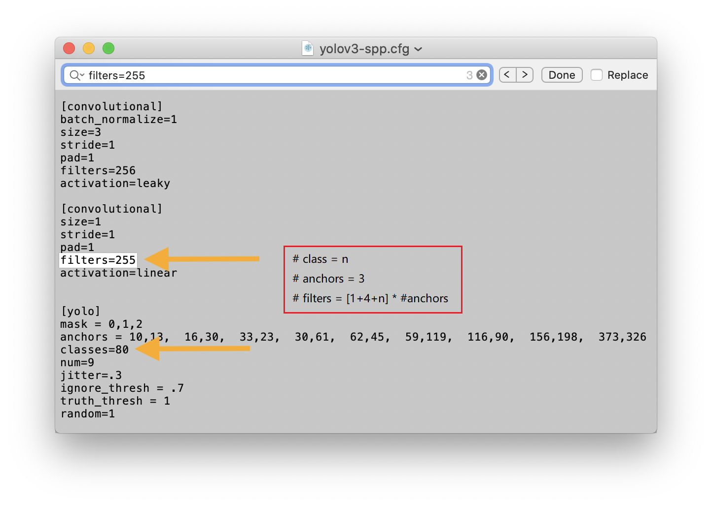

## YOLOV4：You Only Look Once目标检测模型在pytorch当中的实现
---
本README.md是我自己训练过程中总结的，原代码为README_original.md(原先的也看一下，会有一些细节在其中)。本代码来自WongKinYiu/PyTorch_Yolov4,https://github.com/WongKinYiu/PyTorch_YOLOv4

## 实验环境
pytorch == 

## 预训练权重下载
本代码是使用的是WongKinYiu搭建的模仿Yolov5版本的，我下载不下来原作者的预训练权重链接，不过有u3（Yolov3）版本的预训练权重
如要使用u3, 训练所使用的权重可在百度网盘中下载（我未尝试过）

该u3预训练权重是不能在u5中使用的，会出现报错

## 训练步骤
### 训练自己的数据集
#### 一 训练权重
1. 本代码因为无法下载u5的预训练权重，所以未使用迁移学习的方法进行训练、

#### 二 数据集的准备
1. 直接使用Yolov5格式的数据集即可
2. 具体的模版可参考datasets文件夹

### 三 训练之前修改代码，如不修改，本环境下会报错
1. utils/loss.py中line 168代码修改如下
```python
indices.append((b, a, gj.clamp_(0, int(gain[3]) - 1), gi.clamp_(0, int(gain[2]) - 1)))  # image, anchor, grid indices
```
2. utils/plots.py中line 108代码修改如下
```python
return torch.tensor(targets).cpu().numpy()
```
3. cfg/custom.cfg(这里使用的yolov4-pacsp.cfg),相当于将yolov4-pacsp.cfg中的检测头换成自己的classes和filters
line 1247 line 1240 line 1138 line 1131 line 1029 line 1022
```python
classes = 2
fileters=21
```
注意这里的`classes=n`时，`filters`的计算公式


4. data/custom.yaml的修改，这个就按照这个yaml的格式修改即可


### 四 开始训练
```python
python train.py --device 0 --batch-size 8 --img 640 640 --data custom.yaml --cfg cfg/custom.cfg --weights ' ' --name custom
```
1. 注意上面的`--weight ' '`代表的是未使用预训练权重进行训练
