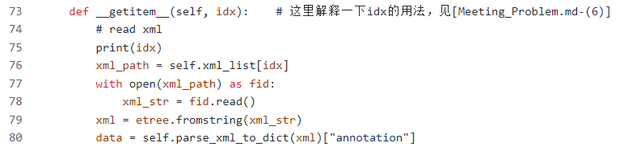
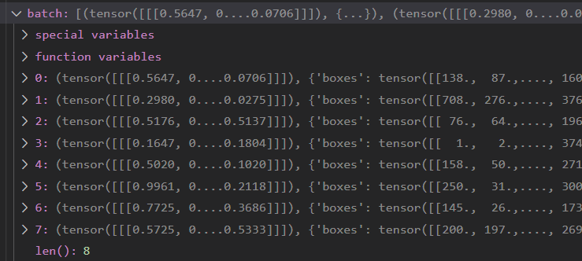
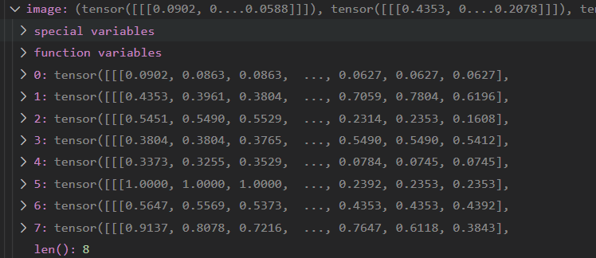
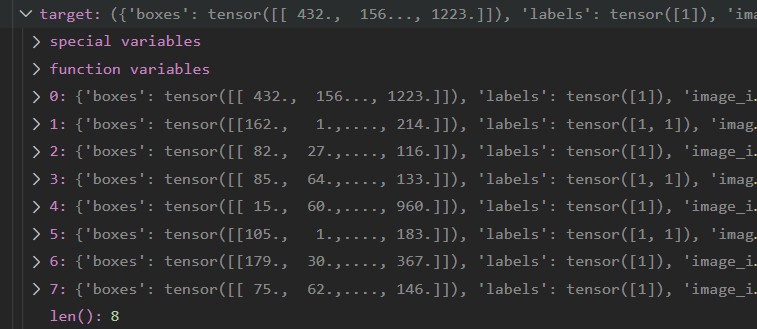

# meeting_problem（本人初学）

### (1) results_file = "results{}.txt".format(datetime.datetime.now().strftime("%Y%m%d-%H%M%S"))的含义 [train_mobilenetv2.py: forty-six lines]
   我们可以尝试使用以下代码解释一下
   ```
   import datetime
   print(datetime.datetime.now())
   results_file = "results{}.txt".format(datetime.datetime.now().strftime("%Y%m%d-%H%M%S"))
   print(results_file)
   ```
   output:
   ```
   2022-07-24 20:19:33.657781
   results20220724-201933.txt
   ```
   strftime参数介绍
   ```
   %Y 四位数的年份表示(0000-9999) %y 两位数的年份表示(00-99)
   %m 月份(01-12)                 %d 月内中的一天(01-31)
   %H 24小时制小时数(00-23)       %l 12小时制小时数(00-12)
   %M 分钟数(00-59)               %S 秒数(00-59)
   ```
   通过上面代码实验就显而易见了
   
   
### (2) train_sampler = torch.utils.data.RandomSampler(train_dataset) [train_mobilenetv2.py: seventy-seven.py]
   
   本人觉得这个就是随机采样数据集，是后面Dataloader中参数batch_size和shuffle的结合
   
   可以查看后几行代码，是一个对这的运用，可以好好感受一下
   
   链接也有代码介绍，可以感受一下：https://blog.csdn.net/lidc1004/article/details/115005612
   
### (3) model.parameters()的用法 [traini_mobilenetv2.py: one hundred and thirty-two lines]
   构建一个网络
   ```
   import torch.nn as nn
   #design Model
   class NeuralNetwork(nn.Module):
       def __init__(self):
           super(NeuralNetwork,self).__init__()
           self.flatten = nn.Flatten()
           self.linear_relu_stack = nn.Sequential(
               nn.Linear(2*2, 5),
               nn.ReLU(),
               nn.Linear(5,3),
               nn.ReLU()
           )

       def forward(self, x):
           x = self.flatten(x)
           logits = self.linear_relu_stack(x)
           return logits

   model = NeuralNetwork()
   print(model)
   print(model.parameters())  #迭代器可以使用for循环，即p for p in model.parameters() if p.requires_grad = True
   print(list(model.parameters())) 
   ```
   output:
   model:
   ```
   NeuralNetwork(
     (flatten): Flatten(start_dim=1, end_dim=-1)
     (linear_relu_stack): Sequential(
       (0): Linear(in_features=4, out_features=5, bias=True)
       (1): ReLU()
       (2): Linear(in_features=5, out_features=3, bias=True)
       (3): ReLU()
     )
   )
   ```
   model.parameters():
   ```
   <generator object Module.parameters at 0x000001E82C26DE40>
   ```
   list(model.parameters()):
   ```
   [Parameter containing:
   tensor([[-0.1933,  0.4739,  0.0775,  0.0639],
           [-0.4586, -0.3750, -0.2054, -0.0058],
           [ 0.4131, -0.0073, -0.2616, -0.4949],
           [-0.2943,  0.1258,  0.1990,  0.1450],
           [-0.0704, -0.0735,  0.4293, -0.2730]], requires_grad=True), Parameter containing:
   tensor([ 0.0749,  0.0115, -0.1905, -0.2829, -0.2272], requires_grad=True), 
   Parameter containing:
   tensor([[-0.2661,  0.2911, -0.3789, -0.4054, -0.3762],
           [ 0.1925,  0.3950,  0.2997, -0.3313,  0.0881],
           [-0.0518,  0.0329, -0.0005,  0.1160, -0.4402]], requires_grad=True), Parameter containing:
   tensor([-0.1595,  0.2987, -0.0165], requires_grad=True)]
   ```
### (4) f"{i:.4f}"和'  '.join(result_info)的用法 [train_mobilenetv2.py: one hundred and fifty-two lines]
   f"{i:.4f}"
   ```
   name = '张三'
   age = 22
   print(f"我的名字是{name}，今年{age:.4f}")
   ```
   output:
   ```
   我的名字是张三，今年22.0000
   ```
   '  '.join(result_info), 
   语法：'delimiter'.join(seq)
   
   delimiter: 分割符，可以为空
   seq: 要连接的元素序列、字符串、元组、字典
   ```
   result_info = "1234"
   print(','.join(result_info))
   result_info = ['1', '2', '3'] #不能是int类型的，如[1, 2, 3]
   print('|'.join(result_info))
   ```
   output:
   ```
   1,2,3,4
   1|2|3
   ```
   
### (5) data = self.parse_xml_to_dict(xml)["annotation"] 的输出结果形式为什么如下 [my_dataset.py: fifty lines]
   
   xml:
   ```
   <Element annotation at 0x23f6c4c8780>
   ```
   
   output:
   ```
   {'folder': 'grassland_fire', 'filename': '002050.jpg', 'path': './data/VOC2020/JPEGImages/002050.jpg', 'source': {'database': 'Unknown'}, 'size': 
   {'width': '400', 'height': '288', 'depth': '3'}, 'segmented': '0', 'object': [{'name': 'fire', 'pose': 'Unspecified', 'truncated': '0', 'difficult': '0', 
   'bndbox':  {'xmin': '137', 'ymin': '17', 'xmax': '294', 'ymax': '216'}}, 
   {'name': 'fire', 'pose': 'Unspecified', 'truncated': '0', 'difficult': '0', 'bndbox': {'xmin': '366', 'ymin': '198', 'xmax': '389', 'ymax': '221'}}]}
   ```
   我们假设一个annotation只有'folder': 'Fire images'和'filename': '000001.jpg', 可以将其对应xml文件
   ```
    def parse_xml_to_dict(self, xml):
        """
        将xml文件解析成字典形式，参考tensorflow的recursive_parse_xml_to_dict
        Args:
            xml: xml tree obtained by parsing XML file contents using lxml.etree

        Returns:
            Python dictionary holding XML contents.
        """

        if len(xml) == 0:  # 遍历到底层，直接返回tag对应的信息 例如<folder>Fire images<folder>, 这样len(xml) == 0, return: {'folder': 'Fire images'}
            return {xml.tag: xml.text}

        result = {}
        for child in xml: 
            child_result = self.parse_xml_to_dict(child)  # 递归遍历标签信息
            if child.tag != 'object':
                result[child.tag] = child_result[child.tag]  # result[folder] = 'Fire images' 、result[filename] = '000001.jpg'
            else:
                if child.tag not in result:  # 因为object可能有多个，所以需要放入列表里
                    result[child.tag] = []
                result[child.tag].append(child_result[child.tag])
        return {xml.tag: result}  # {'annotation': {'folder': 'Fire images', 'filename': '000001.jpg'}}
   ```
  
  ### (6) 定义自己的数据集时__getitem__(self, idx)中的idx的用法 [my_dataset.py: seventy-three lines]
 
 idx其实是数据集dataset的索引值，即dataset[idx]， 也就相当于a = ['a', 'b', 'c'] 中a[1] = b，其中的idx=1
 
 * 一、使用torch.utils.data.DataLoader加载数据集的，其中有batch_size,这意味着必然要对所有数据的进行分开打包，所以一定是使用了dataset[idx]中的所有idx, 所以__getitem__中有了所有的idx
   
   我们现在打印一下idx的值，如
   
   
   
   DataLoader中参数shuffle=True时
   
   
   
   DataLoader中参数shuffle=False时
   
   
   
* 二、可以直接参考mydataset.py中two hundred and forty-five lines code

### (7) 本代码中torch.utils.data.DataLoader中参数collate_fn的用法 [train_mobilenetv2.py: ninety-four lines]

   链接是解释collate_fn的具体含义： https://blog.csdn.net/qq_43391414/article/details/120462055

   在`mydataset.py`中定义的collate_fn函数 `[215-220 lines]`是解释为什么要用collate_fn
   
   先看一下，没有使用自定义的collate_fn, 也就是`[217 lines]`, 即直接打印 print(batch)
   
   
   再看一下经过collate_fn之后模型的输入, `[219 lines]`, 即image和target
   
   
   
   
### (8) 在经过batch_size = 8之后，train_data_loader = torch.utils.data.DataLoader(...)之后, image, target = data for data in train_data_loader中, data也就是模型的输入 [mydataset.py: 257 lines]

   我们看一下模型的输入是什么样子的，也就是image和target
   
   
   
   显而易见，模型的输入是`[batch_size, C, H, W]`
   
   
