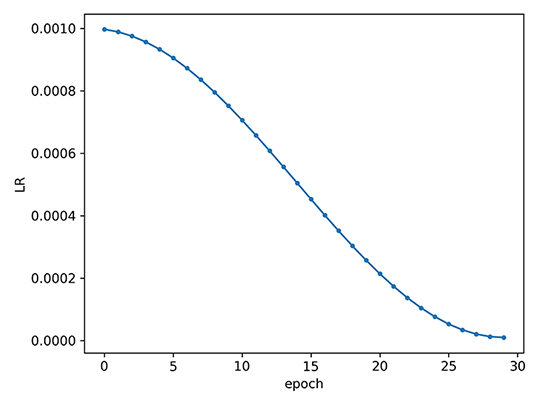
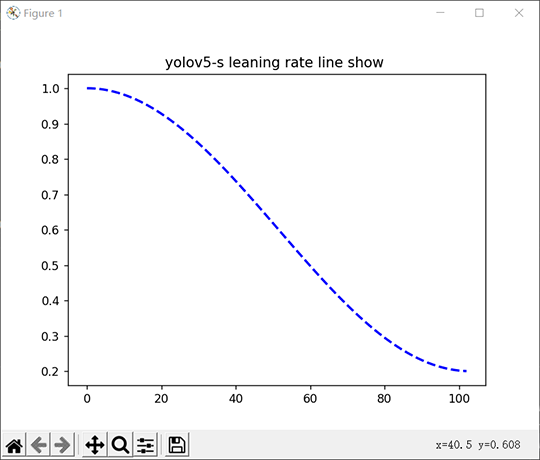

# meeting problem

### (1) `img_path = os.path.join(dataset_dir.replace("labels", "images"),file_name.split(".")[0]) + ".jpg"`所遇到的一些小状况 [calculate_dataset.py: twenty-seven line]

* result:
  ```
  ./my_yolo_dataset/train/images\2008_000008.jpg
  ```
  The result can be directly recognized and run in the local IDE using VScode, 
but when running in an environment such as kaggle or goolge colab, an error will be reported

* improve the code:
  ```
  img_path = dataset_dir.replace("labels", "images") + "/" + file_name.split(".")[0] + ".jpg" 
  ```
  result:
  ```
  ./my_yolo_dataset/train/images/2008_000008.jpg
  ```

### (2) A brief introduction to how tensorboard are used [train.py: three hundered and one line]

* first: create SummaryWriter
  ```
  from tensorboardX import SummaryWriter
  #SummaryWriter压缩（包括）了所有内容
  writer = SummaryWriter('runs/exp-1')
  #创建writer object，log会被存入'runs/exp-1'
  writer2 = SummaryWriter()
  #用自动生成的文件名，文件夹类似'runs/Aug20-17-20-33'
  writer3 = SummaryWriter(comment='3x learning rate')
  #用自动生成的文件名创建writer3 object，注释（comment）会被加在文件名的后面。文件夹类似 'runs/Aug20-17-20-33-3xlearning rate'
  ```
  each subfolder is treated as a different experiment in tensorboard. Each time an experiment is run again with different setting, we need to modify the subfolder       names (such as run/exp2s, run/myexp, etc.)so that different experiments setting can be easily compared. Type tensorboard runs to compared differnet experiment in       tensorboard

* second: Add Scalar
  
  Scalar values are the easiest data type to work with. Usually, we save the loss value for each trainging step, or the correct rate for each epoch, and some times corresponding learning rate. The cost of saving scalar values is very low, just log whatever you think is important. A scalar value can be logged with the command `write.add_scalar('myscalar', values, iteration)`. It should be noted that it is not possible to input `a pytorch tensor` to the program. If x is a torch scalar tensor, remember to use `x.item()` to extract the scalar value.
  
### (3) `os.path.exists(path)` usage [build_utils/parse_config.py: seventy line]
  so far, `path=data/my_data.data` is equivalent to `path=./data/my_data.data`
  
### (4) `lambda` usage [trian.py: one hundred and thirty-eight line]

  There are two ways to show it here, the second one is better to understand.

* first: you can directly uncomment the following comments in the original code, and than set the breakpoint, the picture will be saved in 'LR.png'
  ```
  lf = lambda x: ((1 + math.cos(x * math.pi / epochs)) / 2) * (1 - hyp["lrf"]) + hyp["lrf"]  # cosine ## deteail usage: [meeting_problem.md-(4)]
    scheduler = lr_scheduler.LambdaLR(optimizer, lr_lambda=lf)
    scheduler.last_epoch = start_epoch  # 指定从哪个epoch开始

    # Plot lr schedule
    # y = []
    # for _ in range(epochs):
    #     scheduler.step()
    #     y.append(optimizer.param_groups[0]['lr'])
    # plt.plot(y, '.-', label='LambdaLR')
    # plt.xlabel('epoch')
    # plt.ylabel('LR')
    # plt.tight_layout()
    # plt.savefig('LR.png', dpi=300)

    # model.yolo_layers = model.module.yolo_layers
  ```
  result:

  

* second: just run the following code directly
  ```
  import math
  import numpy as np
  import matplotlib.pyplot as plt


  lr0: 0.01  # initial learning rate (SGD=1E-2, Adam=1E-3)
  lrf: 0.2  # final OneCycleLR learning rate (lr0 * lrf)
  epochs=100
  lf = lambda x: ((1 + math.cos(x * math.pi / epochs)) / 2) * (1 - 0.2) + 0.2  # cosine

  list_lf=[]
  for i in range(epochs):
      value=lf(i)
      list_lf.append(value)

  x=np.linspace(0,102,100)
  plt.title('yolov5-s leaning rate line show ')
  plt.figure(1,figsize=(8,6))
  plt.plot(x,list_lf,color='blue',lw=2,linestyle='--')
  plt.show()
  ```
  result:

  

### (5) `yolov3_spp.cfg` parse file [yolov3_spp.cfg]

* [net] ## not involved in executing code, just interprets some parameters in the model

* first:
  ```
  [convolutional]     ## convolutional layer
  batch_normalize=1   ## BN layer: 1 means uses, 0 means don't use (note: If used, the bias of the convolutional layer should be to set False)
  filters=32          ## the number of the convolutional kernels in the convolutional layer
  size=3              ## the size of the convolutional kernel
  stride=1            ## the stride of the convolutional kernel
  pad=1               ## the padding of the convolutional kernel (whether enable to padding, if it is 1, padding=kernel//2, if it is 0, padding=0)
  activation=leaky    ## activation function
  ```
* second: (you can see the residual block in yolov3spp.png)
  ```
  [shortcut]          ## shortcut connection(equivalent to methods of constructing Residual block) 
  from=-3             ## Fusion with the output of the previous "from=-3" layer
  activation=linear   ## Linear activation(do nothing to the output) (equivalent to "y=x")
  ```
* thrid: (you can see the spp in yolov3spp.png)
  ```
  [maxpool]           ## maxpool layer
  stride=1            ## the stride of the maxpool layer
  size=5              ## the size of the maxpool layer  (the padding of the maxpool layer: padding = (size-1)/2)
  ```
* forth: (you can see the spp in yolov3spp.png)
  ```
  there are two cases
  
  first:
  [route]             ## return to the output of the "layers=-2" layer
  layers=-2
  
  second:
  [route]             ## splicing multi-layer output (concatenate)
  layers=-1, 64       ## the number of layers of layers[-1, 64] indicates that the first module [net] in cfg is not include
                      ## because `61` starts with the second one in the cfg file as 0
  ```

* fifth:
  ```
  [upsample]          ## unsample layer
  stride=2            ## unsample layer magnification
  ```

* sixth:
  ```
  [yolo]
  mask = 0,1,2       ## 0, 1, 2 of the nine anchors are used
  anchors = 10,13,  16,30,  33,23,  30,61,  62,45,  59,119,  116,90,  156,198,  373,326    ## the size of anchor
  classes=80         ## the number of the object 
  num=9
  jitter=.3
  ignore_thresh = .7
  truth_thresh = 1
  random=1
  ```

### (6) `module = nn.Sequential()` detial usage   [model.py: twenty-six line]

  Its definition is as follow:
  ```
  class Sequential(Module): # 继承Module
    def __init__(self, *args):  # 重写了构造函数
    def _get_item_by_idx(self, iterator, idx):
    def __getitem__(self, idx):
    def __setitem__(self, idx, module):
    def __delitem__(self, idx):
    def __len__(self):
    def __dir__(self):
    def forward(self, input):  # 重写关键方法forward
  ```
  Sequential is a container

  Different implementations of the `Sequential` class (four)

* first——simplest sequential model
  ```
  import torch.nn as nn
  model = nn.Sequential(
                    nn.Conv2d(1,20,5),
                    nn.ReLU(),
                    nn.Conv2d(20,64,5),
                    nn.ReLU()
                  )

  print(model)
  print(model[2]) # 通过索引获取第几个层
  '''
  running result：
  Sequential(
    (0): Conv2d(1, 20, kernel_size=(5, 5), stride=(1, 1))
    (1): ReLU()
    (2): Conv2d(20, 64, kernel_size=(5, 5), stride=(1, 1))
    (3): ReLU()
  )
  Conv2d(20, 64, kernel_size=(5, 5), stride=(1, 1))
  '''
  ```
  note:
  
  there is a problem with this, each layer has no name, it is nameed by 0, 1, 2, 3 by default, as can be seen from the above running results

* second——Add a name to each layer
  ```
  import torch.nn as nn
  from collections import OrderedDict
  model = nn.Sequential(OrderedDict([
                    ('conv1', nn.Conv2d(1,20,5)),
                    ('relu1', nn.ReLU()),
                    ('conv2', nn.Conv2d(20,64,5)),
                    ('relu2', nn.ReLU())
                  ]))

  print(model)
  print(model[2]) # 通过索引获取第几个层
  '''
  running result：
  Sequential(
    (conv1): Conv2d(1, 20, kernel_size=(5, 5), stride=(1, 1))
    (relu1): ReLU()
    (conv2): Conv2d(20, 64, kernel_size=(5, 5), stride=(1, 1))
    (relu2): ReLU()
  )
  Conv2d(20, 64, kernel_size=(5, 5), stride=(1, 1))
  '''
  ```
  note:
  
  It can be seen from the above results that each layer has its name at this time, but it should be noted at this time that the layer cannot be obtained directly by the name, but only by the index
  
  That is:
  
  `model[2] is correct`
  
  `model["conv2"] is wrong` 
  
  This is actually implemented by its definition. Looking at the Sequential definition above, only index access is supported 

  third——the third implementation of Sequential 
  ```
  import torch.nn as nn
  from collections import OrderedDict
  model = nn.Sequential()
  model.add_module("conv1",nn.Conv2d(1,20,5))
  model.add_module('relu1', nn.ReLU())
  model.add_module('conv2', nn.Conv2d(20,64,5))
  model.add_module('relu2', nn.ReLU())

  print(model)
  print(model[2]) # 通过索引获取第几个层
  ```
  `add_module` is defined its parent class module, Sequential inherits its parent class. Its definition is as follow:
  ```
  def add_module(self, name, module):
  ```
* forth——the forth implementation of Sequential
    ```
    module = nn.Sequential
    module = nn.MaxPool2D(kernel_size=k, stride=stride, padding=(k-1)//2)
    ```
    
### (7) `Path(path)`的用法  [build_utils/dataset.py: sixty-four lines]
    
  Path(): 该模块提供表示文件系统路径的类，其语义适用于不同的操作系统。路径类被分为提供纯计算操作而没有I/O的纯路径，以及从纯路径继承而来但提供I/O操作的具体路径。
  
  How to get file path
   
   (1) name: the last part of the file path
   
   (2) suffix: the extension of the last part of the file path
   
   (3) stem: the last part of the file path without the suffix
   
   (4) suffixes: multiple extensions for file path
   
   (5) with_suffix(suffix): add the extension to the end of the file and return a new path, if the extension exists, it is invalid
   
   (6) with_name(name): replace the last part of file path, returning the new path
    
    ```
    p = Path('/etc/config/system/cf.config.gz')
    print(p.name)     #cf.config.gz
    print(p.suffix)      #.gz
    print(p.suffixes)    #['.config', '.gz']
    print(p.stem)    #cf.config
    print(p.with_name('cf.config')) 
    #/etc/config/system/cf.config
    print(p.with_suffix('.txt'))
    #/etc/config/system/cf.config.txt
    ```

### (8) `bi = np.floor(np.arange(n) / batch_size).astype(np.int)`详解  [build_utils/dataset.py: eighty-six line]

  read the following code directly
  ```
  import numpy as np

  batch_size = 4
  n = 10

  bi = np.arange(n)  # [0, 1, 2, 3, 4, 5, 6, 7, 8, 9]
  print(bi)
  bi = bi/batch_size # [0., 0.25, 0.5,  0.75, 1., 1.25, 1.5, 1.75, 2., 2.25]
  print(bi)
  bi = np.floor(bi)  # output:[0., 0., 0., 0., 1., 1., 1., 1., 2., 2.]  effect: round down(向下取整)
  print(bi)

  bi = bi//batch_size # [0., 0., 0., 0., 1., 1., 1., 1., 2., 2.] 
  print(bi)
  ```
  
### (9) `rotation = dict(img._getexif().items())[orientation]` 为什么要使用这个东西 [build_utils/dataset.py: thirty-seven line]

可以看一下这两个链接：[http](https://blog.csdn.net/qq_34367804/article/details/72906145)
https://blog.csdn.net/mizhenpeng/article/details/82794112

* 对于手机、相机等设备拍摄的照片，由于手持方向的不同，拍出来的照片可能是旋转0°、90°、180°和270°。即使在电脑上利用软件将其转正，他们的exif信息中还是会保留方位信息。
在用PIL读取这些图像时，读取的是原始数据，也就是说，即使电脑屏幕上显示是正常的照片，用PIL读进来后，也可能是旋转的图像，并且图片的size也可能与屏幕上的不一样。

* 压缩图片。本来是很简单需求，三下五除二就写好了，但是在自己用手机上传图片的时候发现压缩后的图片都歪了，查了一下，原因是图片中的exif信息中的Orientation记录中图片的旋转角度。需要根据这个来旋转图片。
